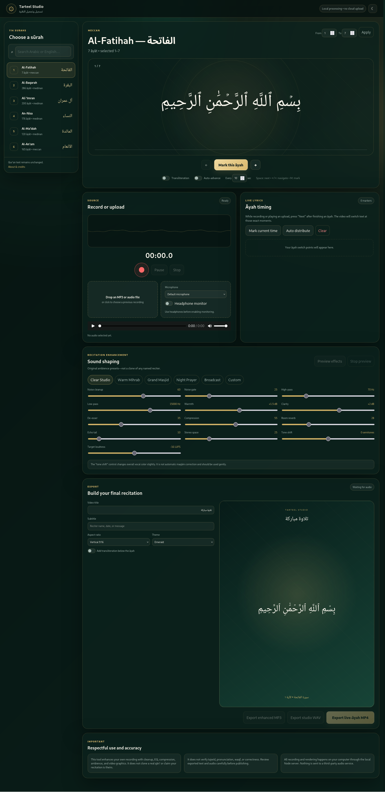

# Tarteel Studio

[](https://github.com/Adam-ZS/tarteel-studio/stargazers)
[](LICENSE)
[](package.json)
[](package.json)
[](https://tarteel-studio-xi.vercel.app)

A local web studio for reading the Qur'an āyah-by-āyah, recording your voice,
processing an existing MP3/WAV/M4A recording, adding recitation-focused room
ambience, and exporting a live-āyah MP4.



## Main features

- All 114 sūrahs and 6,236 āyāt after `npm install`
- Large Arabic teleprompter with previous/next controls and a selectable range
- Microphone recording in supported desktop browsers
- Upload existing MP3, WAV, M4A, AAC, FLAC, OGG, WebM, or MP4 audio
- Live timing markers: press **Next** when you finish each āyah
- Automatic timing by relative āyah word length when manual timing is absent
- Audio cleanup, gate, high-pass, low-pass, warmth, clarity, de-essing,
  compression, room reverb, echo, stereo space, subtle tone shift, loudness,
  and limiting
- Original presets: Clear Studio, Warm Mihrab, Grand Masjid, Night Prayer,
  and Broadcast
- Enhanced MP3 and studio WAV exports
- MP4 export in vertical 9:16, landscape 16:9, or square 1:1
- Five video themes, Arabic title, subtitle, and optional transliteration
- Browser audio preview before the higher-quality FFmpeg export
- Dark/light interface, keyboard navigation, microphone selection, waveform,
  headphone monitoring, auto-advance, search, and range selection
- Audio and rendering stay on your own computer

## What this intentionally does not do

The app does not clone, impersonate, or reproduce the identity of a real named
qāriʾ. Its presets are original combinations of cleanup, dynamics, equalization,
and room ambience. It also does not certify tajwīd, pronunciation, waqf, maqām,
or recitation correctness.

The tone-shift control is a gentle whole-recording adjustment, not automatic
note correction. Use it subtly so the recitation remains natural.

## Requirements

- Node.js 18 or newer
- A current Chromium, Firefox, or Safari browser
- Around 1 GB of free disk space for dependencies and temporary renders
- Headphones if microphone monitoring is enabled

No separate FFmpeg installation is normally required; the project installs
`ffmpeg-static` and `ffprobe-static` through npm.

## Start the app

### Windows

Double-click `start.bat`, or open PowerShell in this folder and run:

```powershell
npm install
npm start
```

### macOS or Linux

Double-click/run `start.sh`, or use:

```bash
chmod +x start.sh
./start.sh
```

Then open:

```text
http://127.0.0.1:4173
```

Microphone permission is requested only when you press the record button.

## Deploy to Vercel

This project is Vercel-ready (`vercel.json` + exported Express app). Import the
repository at vercel.com and it builds as a Node serverless function with the
FFmpeg binaries bundled. Notes:

- The free (Hobby) plan caps request bodies at 4.5 MB, so live recordings or
  uploads longer than roughly 3 minutes cannot be processed on the deployed
  version — keep long sūrahs on the local server, which has no size limit.
- Function duration on Hobby is 300 seconds (configured via `vercel.json`);
  long MP4 renders may still exceed it on slow sūrahs.
- All audio is processed in the function's `/tmp` and deleted after the
  download completes.

## Recommended workflow

1. Select a sūrah and optionally choose an āyah range.
2. Press the red record button, or upload an existing audio file.
3. Read the displayed āyah. Press **Next** when the next āyah begins.
4. Review timing markers. Edit a marker's seconds or use Auto distribute.
5. Choose an ambience preset and adjust the controls.
6. Preview the effects. The browser preview is approximate; export uses FFmpeg.
7. Enter the video title, choose an aspect ratio and theme, then export MP4.

Keyboard controls outside form fields:

- `Space` or `Right Arrow`: next āyah and capture a timing marker while active
- `Left Arrow`: previous āyah
- `M`: mark the current āyah at the current audio time

## Rendering notes

MP4 generation creates one Arabic graphic per timed āyah and joins those frames
against the processed audio. Long recordings can require substantial RAM and
CPU. The page must remain open until the browser downloads the finished file.

Arabic video rendering uses an installed Arabic-capable system font. Common
fallbacks include Noto Naskh Arabic, Amiri, Scheherazade New, DejaVu Sans, and
Arial. Install an Arabic font on the operating system if exported text appears
as boxes.

## Troubleshooting

### The Qur'an list does not load

Stop the server, remove `node_modules`, then run `npm install` again. The app
loads Qur'an text from the installed `quran-json` package and uses its public CDN
only as a browser fallback.

### The microphone is blocked

Open the browser's site permissions for `127.0.0.1`, allow microphone access,
and reload. Select the device from the Microphone menu after permission is
accepted.

### FFmpeg export fails

Try the Clear Studio preset, reduce reverb/stereo settings, and retry. The server
automatically retries a conservative audio chain and falls back from H.264 to
MPEG-4 video if needed. Check the terminal window for the detailed FFmpeg error.

### Audio preview sounds different from export

The preview uses the browser Web Audio API. The downloaded file is rendered by
FFmpeg with loudness normalization and a more complete filter chain, so a small
difference is expected.

## Privacy

The browser sends your audio only to the local Node server at `127.0.0.1`.
Temporary files are removed after the download response completes. Do not expose
the local server publicly without adding authentication, HTTPS, rate limiting,
and secure file isolation.

## Data and licenses

- Application code: MIT License, see `LICENSE`.
- Qur'an dataset: `quran-json` 3.1.2. Keep that package's own Creative Commons
  attribution and license when redistributing its data.
- See `CREDITS.md` for the data notice.

## Developer commands

```bash
npm run check
npm run dev
```
